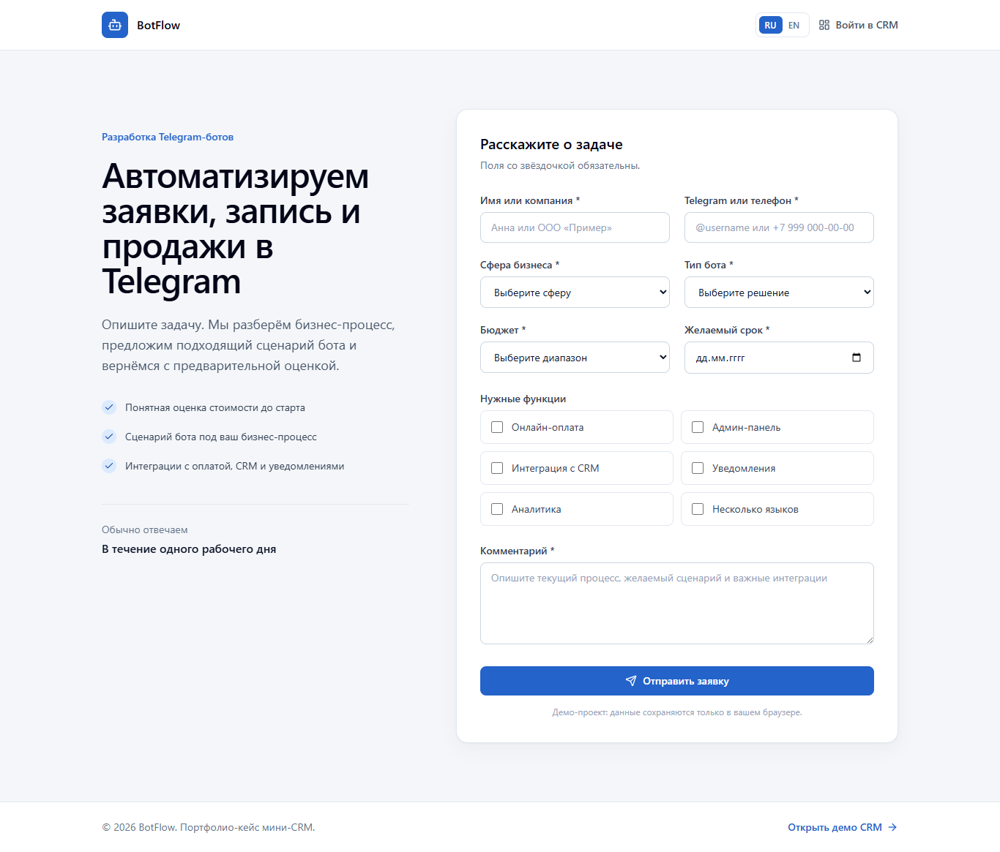
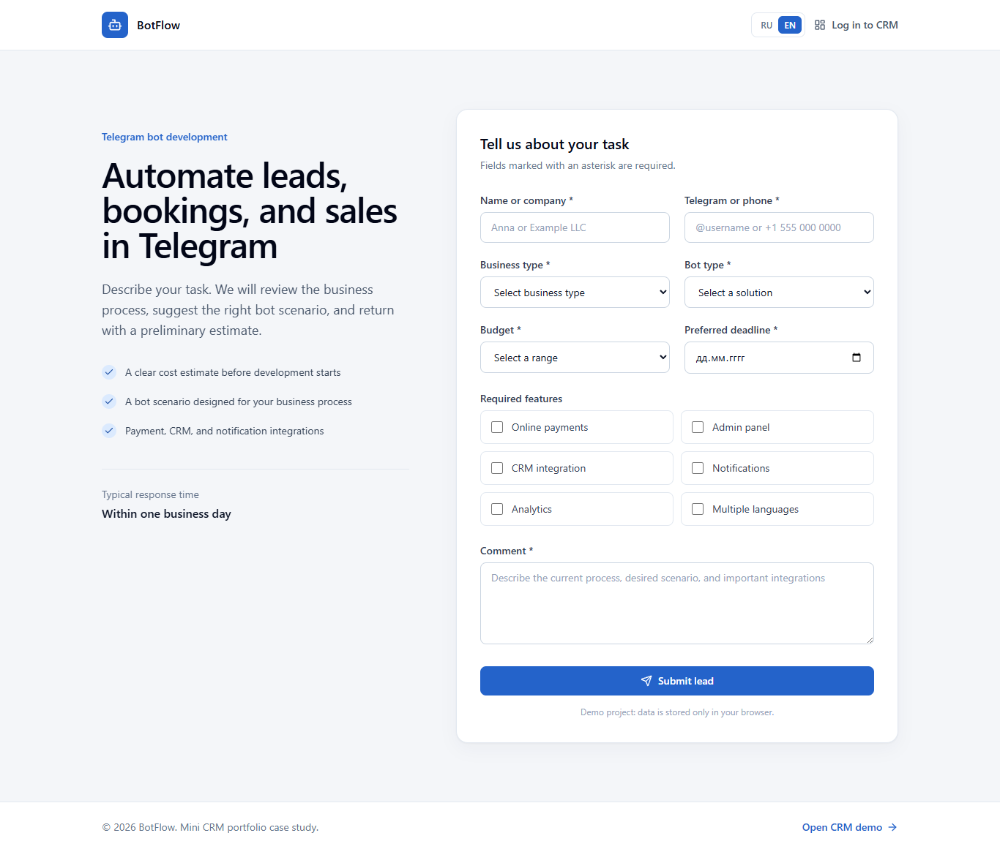

# BotFlow CRM


BotFlow CRM is a bilingual mini CRM for handling Telegram bot development inquiries. The demo follows a lead from a public form through qualification, pricing, notes, status management, filtering, and CSV export using browser-local persistence.

## Live Demo

https://bot-orders-crm.vercel.app

## Source Code

https://github.com/Andrey15211/bot-orders-crm

## Features

- Public lead form with localized Zod validation
- Mock login and protected admin route structure
- CRM dashboard totals and responsive lead views
- Search, status/business filters, and date sorting
- Lead details, manager notes, status updates, and price estimation
- CSV export of the current filtered result
- Loading, error, empty, and not-found states
- Replaceable Supabase-ready client boundary

## Tech Stack

- Next.js App Router
- React and TypeScript
- Tailwind CSS
- next-intl
- React Hook Form and Zod
- TanStack Table
- Supabase JS
- localStorage and mock cookie authentication

## Localization

- RU/EN support: public form, CRM, validation, statuses, filters, and CSV headers
- Default language: Russian (`/ru`)
- Language switcher: available on public and admin screens
- English CRM routes: `/en/admin` and `/en/admin/login`

## Screenshots

### Desktop



### Mobile

Planned path: `docs/screenshots/mobile.png`

### RU/EN example



Mobile screenshot will be added after final device-width capture.

## Local Development

```bash
npm install
npm run dev
npm run build
```

The demo accepts any valid login values and stores lead changes in the current browser.

## Deployment

Deployed on Vercel with the Next.js preset. Real shared CRM persistence and production authentication require connecting Supabase and enforcing server-side authorization/RLS.

## What this project demonstrates

- CRM logic and lead lifecycle modeling
- Fullstack-like architecture and migration boundaries
- Data-table filtering, sorting, details, and export
- Form validation and practical admin states
- Localized business application UI

## Recommended GitHub Topics

`crm` `lead-management` `telegram-bot` `nextjs` `typescript` `tanstack-table` `react-hook-form` `next-intl` `supabase` `vercel`
